**项目简介：**  
本项目基于主流的前后端分离架构，采用 **SpringBoot + Vue 技术栈**，配套 **MySQL 数据库**，适用于毕业设计与课题实训开发。  
本人已整理了超 **4000 多套毕业设计源码+论文+开题报告+PPT...**，涵盖 **Java、SpringBoot、Vue、SSM、uni-app 小程序、PHP、Android** 等方向，支持功能修改定制与论文服务。  
**团队提供以下服务：**  
- 项目代码修改与调试  
- 数据库配置与远程协助  
- 论文定制与修改  
**获取更多的4000多套源码或SQL文件请联系：**  
- QQ：3906443360 微信：BesheHelp

# springboot014校园管理系统的设计与实现

5.1管理员功能模块

管理员登录，通过填写注册时输入的用户名、密码、角色进行登录，如图5-1所示。

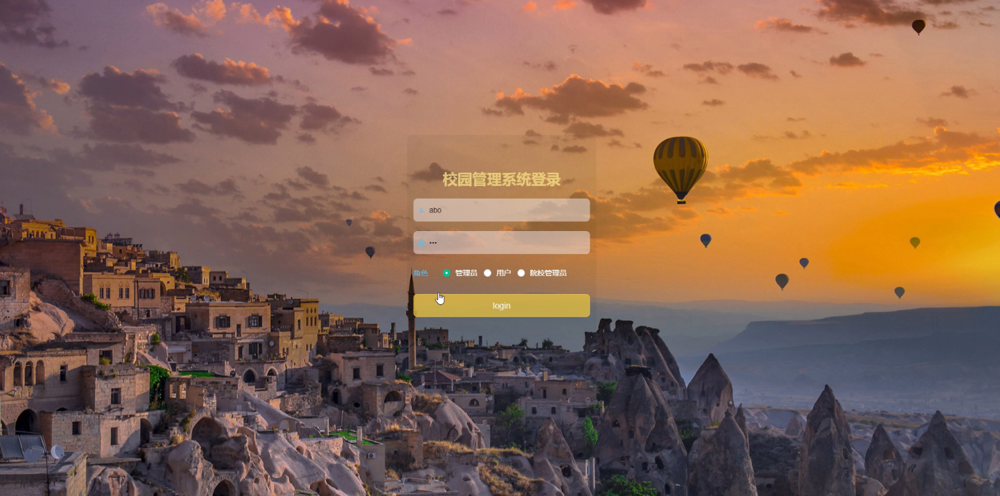

图5-1管理员登录界面图

管理员登录进入校园管理系统可以查看首页、个人中心、院校管理、用户管理、单位类别管理、院校管理员管理、单位管理、通知推送管理、投票信息管理、通知回复管理等信息。

院校管理，在院校管理页面中可以通过填写学院名称、资料文件、学院简介、职工人数、院校账号等信息进行详情、修改、删除等操作，如图5-2所示。还可以根据需要对用户管理进行详情、修改或删除等详细操作，如图5-3所示。

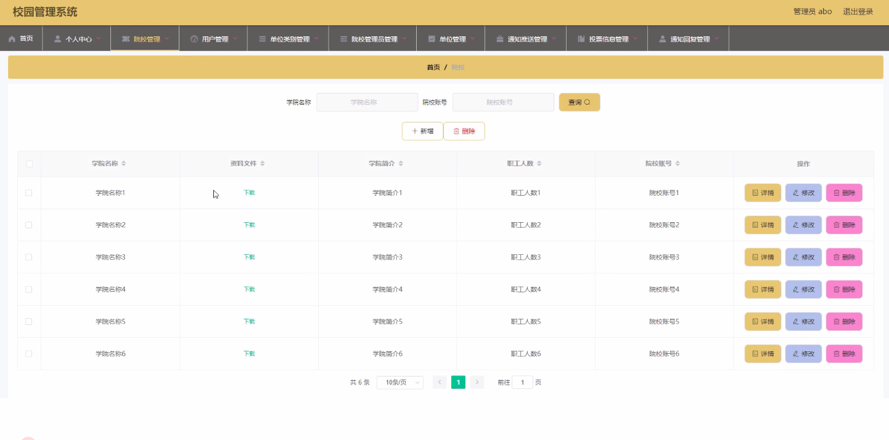

图5-2院校管理界面图

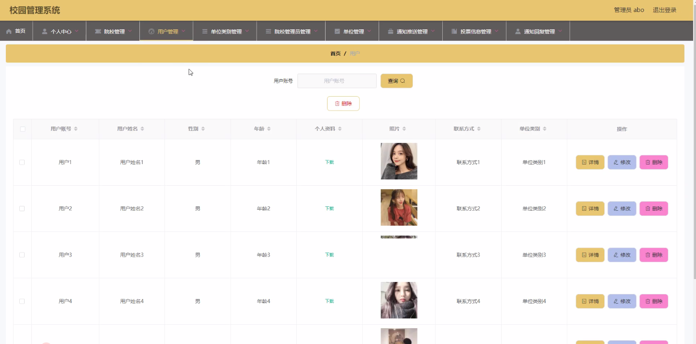

图5-3用户管理界面图

单位类别管理，在单位类别管理页面中可以填写单位类别等信息，并可根据需要对单位类别管理进行详情、修改或删除等操作，如图5-4所示。

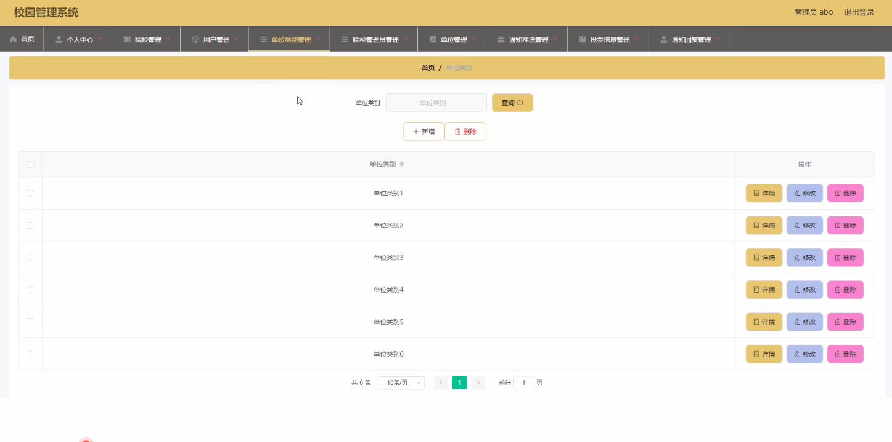

图5-4单位类别管理界面图

院校管理员管理，在院校管理员管理页面中可以填写院校账号、负责人姓名、性别、年龄、联系方式、备注等信息，并可根据需要对院校管理员管理进行详情、修改或删除等详细操作，如图5-5所示。

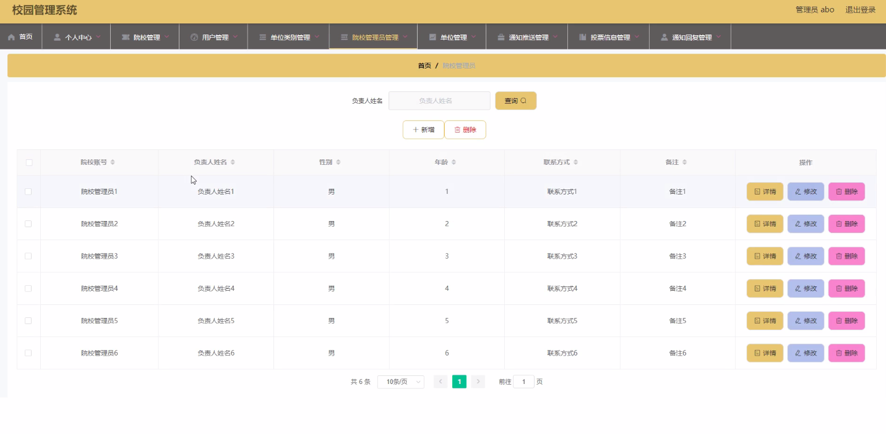

图5-5院校管理员管理界面图

单位管理，在单位管理页面中可以填写姓名、性别、年龄、照片、个人资料、单位类别、备注、联系方式等信息，并且根据需要对单位管理进行详情、绑定用户、修改或删除等详细操作，如图5-6所示。

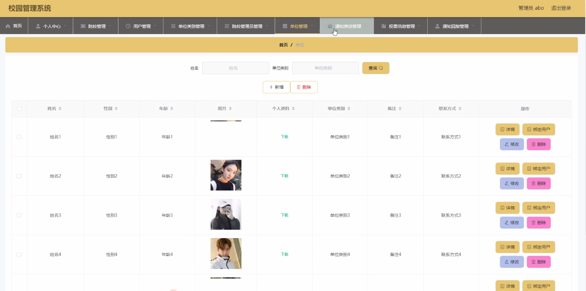

图5-6单位管理界面图

通知推送管理，在通知推送管理页面中可以填写院校账号、负责人姓名、用户账号、用户姓名、通知内容、发送时间等信息，并且根据需要对通知推送管理进行详情、修改或删除等详细操作，如图5-7所示。

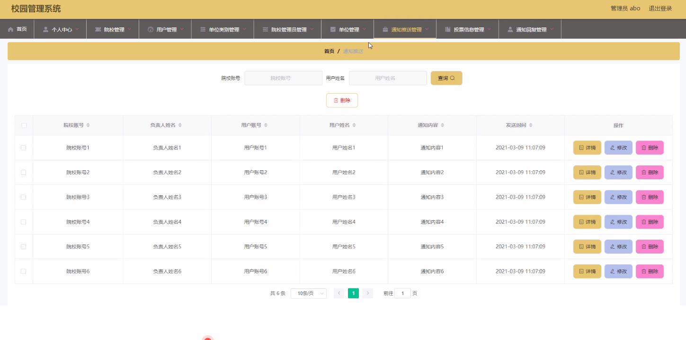

图5-7通知推送管理界面图

投票信息管理，在投票信息管理页面中可以填写候选人姓名、性别、年龄、赞成票、反对票、更新时间等内容，并且根据需要对投票信息管理进行详情、修改或删除等详细操作，如图5-8所示。

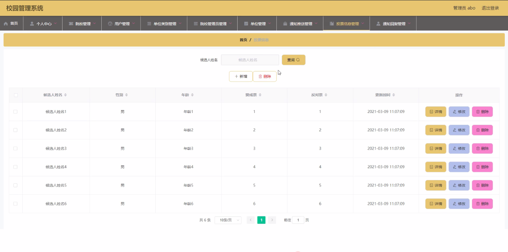

图5-8投票信息管理界面图

通知回复管理，在通知回复管理页面中可以填写院校账号、用户账号、回复内容、回复时间等内容，并且根据需要对通知回复管理进行详情、修改或删除等详细操作，如图5-9所示。

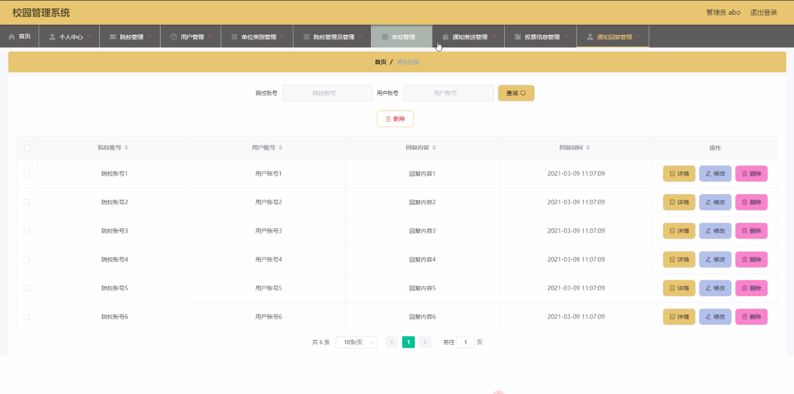

图5-9通知回复管理界面图

5.2用户功能模块

用户登录进入校园管理系统可以查看首页、个人中心、单位管理、通知推送管理、投票信息管理、通知回复管理等内容。

个人信息，在个人信息页面中通过填写用户账号、用户姓名、性别、年龄、个人资料、照片、联系方式、单位类别等信息还可以根据需要对个人信息进行修改，如图5-10所示。

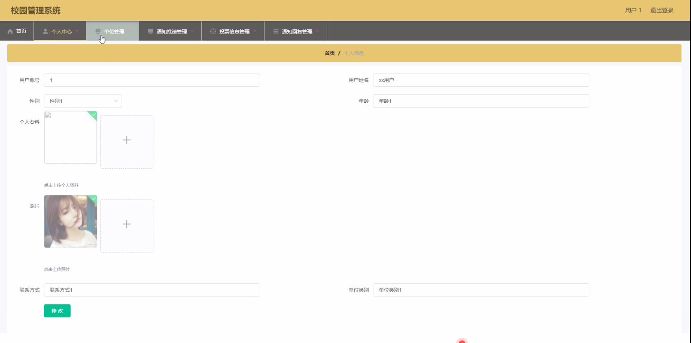

图5-10个人信息界面图

单位管理，在单位管理页面中可以查看姓名、性别、年龄、照片、个人资料、单位类别、备注、联系方式等信息内容，并且根据需要对单位管理进行详情等其他详细操作，如图5-11所示。

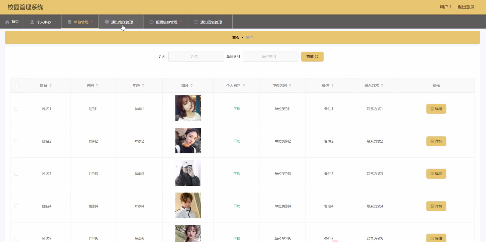

图5-11单位管理界面图

通知推送管理，在通知推送管理页面中通过填写院校账号、负责人姓名、用户账号、用户姓名、通知内容、发送时间等内容进行详情、修改、删除等操作，如图5-12所示。

图5-12通知推送管理界面图

投票信息管理，在投票信息管理页面中通过填写候选人姓名、性别、年龄、赞成票、反对票、更新时间等内容进行详情等操作，如图5-13所示。

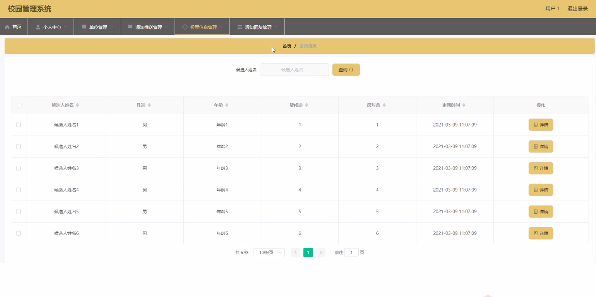

图5-13投票信息管理界面图

5.3院校管理员功能模块

院校管理员登录进入校园管理系统可以查看首页、个人中心、用户管理、单位类别管理、单位管理、通知推送管理、投票信息管理、通知回复管理等内容。

个人信息，在个人信息页面中通过填写院校账号、负责人姓名、性别、年龄、联系方式、备注等信息还可以根据需要对个人信息进行修改等操作，如图5-14所示。

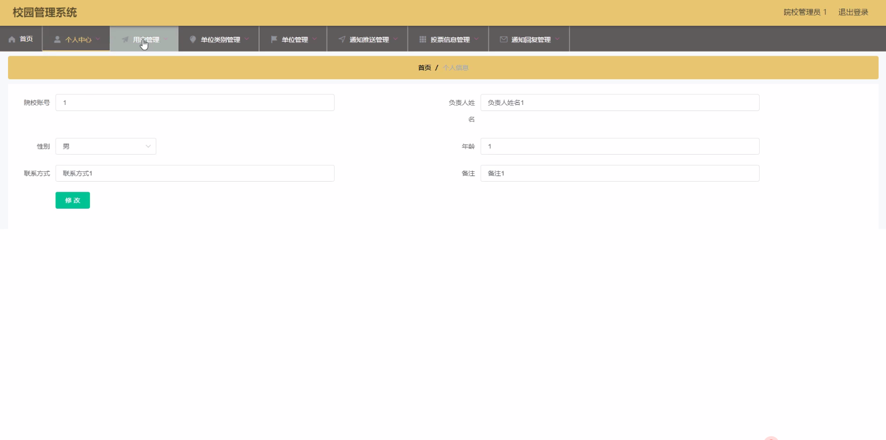

图5-14个人信息界面图

用户管理，在用户管理页面中可以填写用户账号、用户姓名、性别、年龄、个人资料、照片、联系方式、单位类别等信息内容，并且根据需要对用户管理进行详情、修改或删除等其他详细操作，如图5-15所示。

图5-15用户管理界面图

单位类别管理，在单位类别管理页面中通过填写单位类别等内容进行详情、修改、删除，如图5-16所示。

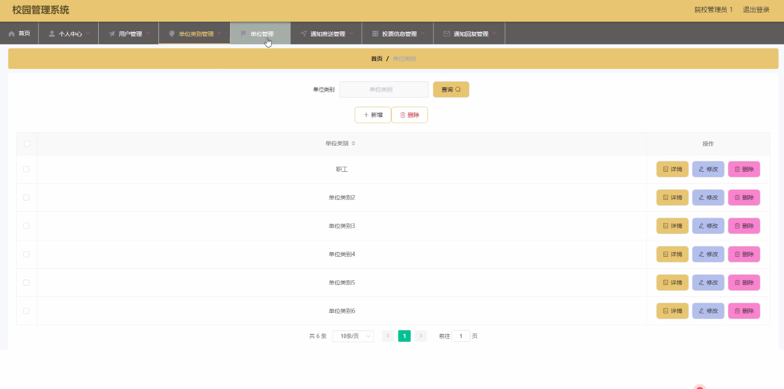

图5-16单位类别管理界面图

通知推送管理，在通知推送管理页面中通过填写院校账号、负责人姓名、用户账号、用户姓名、通知内容、发送时间等内容进行详情、回复等操作，如图5-17所示。

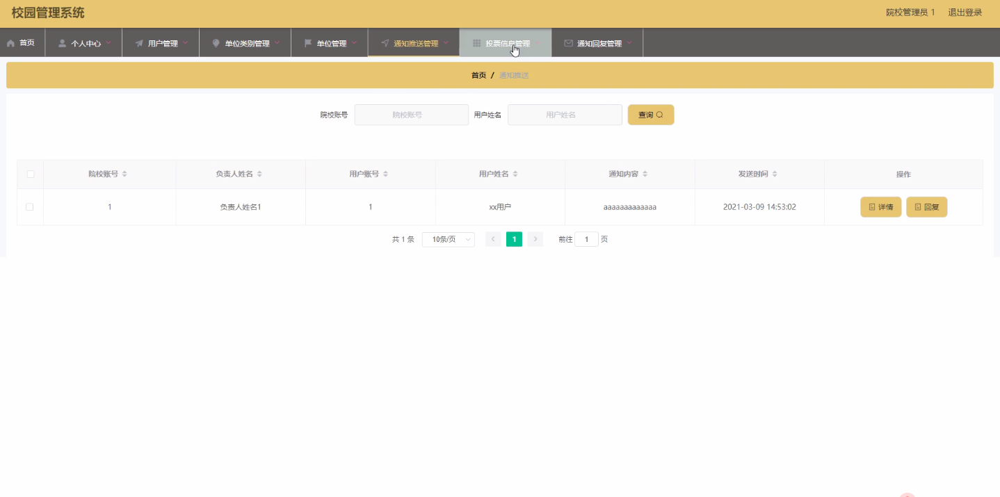

图5-17通知推送管理界面图

通知回复管理，在通知回复管理页面中通过填写院校账号、用户账号、回复内容、回复时间等内容进行详情、修改、删除等操作，如图5-18所示。

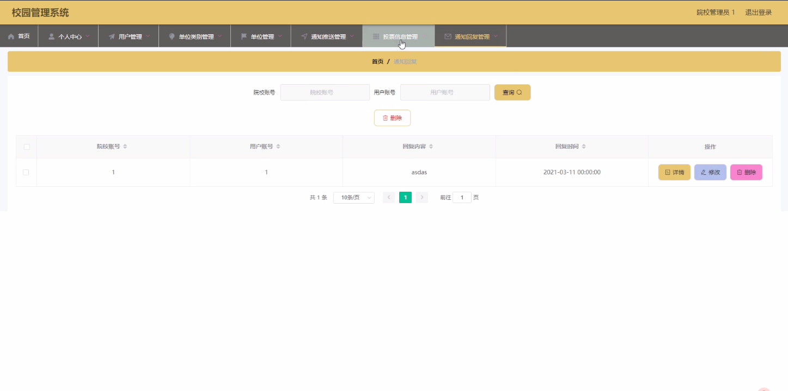

图5-18通知回复管理界面图